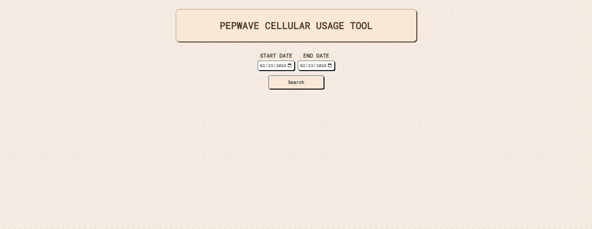

The Pepwave Usage Tracker is a tool used to view how much cellular data is being used for our routers in bulk. 
- It can view and add multiple days
- It does not show any devices below 3GB of usage
- Handles errors exceptionally

  Below is a demo video and an image attachment.

[Cellular Usage Report Demo Video](https://drive.google.com/file/d/17zwrE9ClT8y9TM0a7tC5VttyLJyv1Hgp/view?usp=sharing)
